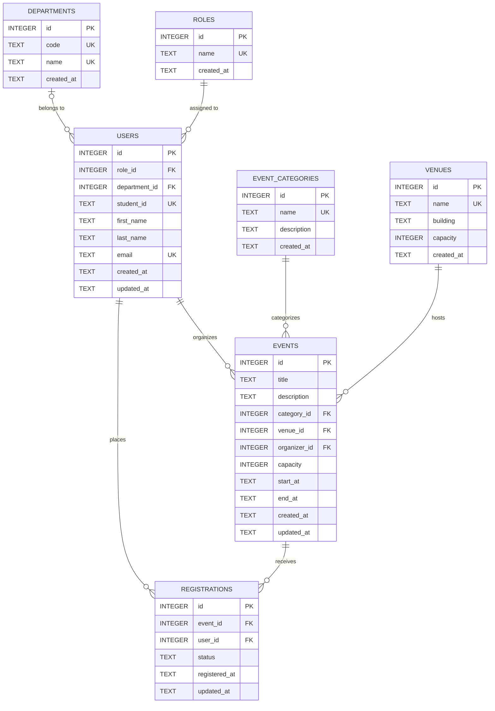

# Database Architecture & 3NF Schema Specification

## Online Campus Event Management System
**Lead:** Member 3 (Umandal, Alen)
---

## 1. Schema Design and 3NF Justification

### Architectural Assumptions
1. **SQLite & Prisma Monolith Compatibility**: SQLite is used as the underlying relational database with `PRAGMA foreign_keys = ON;` enabled. Timestamps are stored as ISO 8601 strings (`TEXT`) to map cleanly to Prisma's `DateTime` type. Primary keys utilize standard SQLite auto-incrementing 64-bit integers (`INTEGER PRIMARY KEY AUTOINCREMENT`).
2. **Simplified Role Simulation**: Authentication is simulated within the application monolith via a role toggle. Roles are stored in a lookup table (`roles`) rather than hardcoded enums in code, allowing clean referential integrity and future role expansion.
3. **Capacity Semantics**: A physical `venues` table maintains structural building capacity. Each `events` record defines an event-specific `capacity` ($1 \le \text{event.capacity} \le \text{venue.capacity}$). The active attendee count (`status != 'CANCELLED'`) is strictly bounded by `events.capacity` via database triggers.
4. **Registration Lifecycle**: A student can hold at most one registration record per event (`UNIQUE(event_id, user_id)`). Registration statuses are constrained to `'CONFIRMED'`, `'ATTENDED'`, or `'CANCELLED'`. Cancelled registrations relinquish reserved spots and do not count toward capacity.
5. **Data Integrity & Student IDs**: Students must provide a unique institutional `student_id`. Administrator accounts that are not enrolled students leave `student_id` as `NULL` (which SQLite permits without violating `UNIQUE` constraints).

---

### Entity Specifications

#### 1. `roles`
*Lookup table defining system access permissions.*
* **Columns**:
  * `id` (`INTEGER`, PK, Autoincrement)
  * `name` (`TEXT`, NOT NULL, Unique, Check: `'STUDENT'`, `'ADMIN'`)
  * `created_at` (`TEXT`, NOT NULL, Default: Current ISO 8601)
* **Primary Key**: `id`
* **Foreign Keys**: None
* **Candidate Keys**: `id`, `name`
* **Normal Form Justification**:
  * **1NF**: Every field contains scalar, atomic values; primary key is defined.
  * **2NF**: In 1NF and no composite key exists; thus, no partial key dependencies.
  * **3NF**: In 2NF and no non-key transitive dependencies exist.

#### 2. `departments`
*Lookup table defining academic and administrative units.*
* **Columns**:
  * `id` (`INTEGER`, PK, Autoincrement)
  * `code` (`TEXT`, NOT NULL, Unique) — e.g., `'CCIS'`, `'COE'`
  * `name` (`TEXT`, NOT NULL, Unique) — e.g., `'College of Computer Studies'`
  * `created_at` (`TEXT`, NOT NULL, Default: Current ISO 8601)
* **Primary Key**: `id`
* **Foreign Keys**: None
* **Candidate Keys**: `id`, `code`, `name`
* **Normal Form Justification**:
  * **1NF**: Attributes are atomic; unique records are established.
  * **2NF**: In 1NF with a single-column primary key; no partial dependencies.
  * **3NF**: In 2NF; all non-key attributes are directly and solely dependent on the primary key.

#### 3. `users`
*Stores identity, student identifiers, and organizational affiliations for students and administrators.*
* **Columns**:
  * `id` (`INTEGER`, PK, Autoincrement)
  * `role_id` (`INTEGER`, NOT NULL, FK $\to$ `roles.id`)
  * `department_id` (`INTEGER`, NULL, FK $\to$ `departments.id`)
  * `student_id` (`TEXT`, NULL, Unique)
  * `first_name` (`TEXT`, NOT NULL)
  * `last_name` (`TEXT`, NOT NULL)
  * `email` (`TEXT`, NOT NULL, Unique, Check: Valid email format)
  * `created_at` (`TEXT`, NOT NULL, Default: Current ISO 8601)
  * `updated_at` (`TEXT`, NOT NULL, Default: Current ISO 8601)
* **Primary Key**: `id`
* **Foreign Keys**: 
  * `role_id` references `roles(id)`
  * `department_id` references `departments(id)`
* **Candidate Keys**: `id`, `email`, `student_id` (when not null)
* **Normal Form Justification**:
  * **1NF**: Atomic attributes; names are split into `first_name` and `last_name`; no repeating groups.
  * **2NF**: In 1NF with a simple primary key (`id`); all non-key columns depend on the entire primary key.
  * **3NF**: In 2NF; department names and role descriptions are factored out to foreign keys (`department_id`, `role_id`), eliminating transitive dependencies like $\text{user\_id} \to \text{department\_id} \to \text{department\_name}$.

#### 4. `event_categories`
*Classifies events into distinct functional groups.*
* **Columns**:
  * `id` (`INTEGER`, PK, Autoincrement)
  * `name` (`TEXT`, NOT NULL, Unique) — e.g., `'Workshop'`, `'Career Fair'`
  * `description` (`TEXT`, NULL)
  * `created_at` (`TEXT`, NOT NULL, Default: Current ISO 8601)
* **Primary Key**: `id`
* **Foreign Keys**: None
* **Candidate Keys**: `id`, `name`
* **Normal Form Justification**:
  * **1NF**: Scalar values and atomic rows.
  * **2NF**: In 1NF with single-column primary key; no partial dependency.
  * **3NF**: In 2NF; non-key attribute (`description`) depends solely on the primary key.

#### 5. `venues`
*Represents physical campus facilities and their maximum safety limits.*
* **Columns**:
  * `id` (`INTEGER`, PK, Autoincrement)
  * `name` (`TEXT`, NOT NULL, Unique) — e.g., `'Main Auditorium'`
  * `building` (`TEXT`, NOT NULL)
  * `capacity` (`INTEGER`, NOT NULL, Check: $> 0$)
  * `created_at` (`TEXT`, NOT NULL, Default: Current ISO 8601)
* **Primary Key**: `id`
* **Foreign Keys**: None
* **Candidate Keys**: `id`, `name`
* **Normal Form Justification**:
  * **1NF**: Atomic attributes; positive integer capacity.
  * **2NF**: In 1NF; no composite primary key.
  * **3NF**: In 2NF; building location and room capacity depend solely on `id`.

#### 6. `events`
*Contains event schedule, target capacity, venue allocation, and administrator assignment.*
* **Columns**:
  * `id` (`INTEGER`, PK, Autoincrement)
  * `title` (`TEXT`, NOT NULL)
  * `description` (`TEXT`, NULL)
  * `category_id` (`INTEGER`, NOT NULL, FK $\to$ `event_categories.id`)
  * `venue_id` (`INTEGER`, NOT NULL, FK $\to$ `venues.id`)
  * `organizer_id` (`INTEGER`, NOT NULL, FK $\to$ `users.id`)
  * `capacity` (`INTEGER`, NOT NULL, Check: $> 0$)
  * `start_at` (`TEXT`, NOT NULL)
  * `end_at` (`TEXT`, NOT NULL, Check: `end_at > start_at`)
  * `created_at` (`TEXT`, NOT NULL, Default: Current ISO 8601)
  * `updated_at` (`TEXT`, NOT NULL, Default: Current ISO 8601)
* **Primary Key**: `id`
* **Foreign Keys**:
  * `category_id` references `event_categories(id)`
  * `venue_id` references `venues(id)`
  * `organizer_id` references `users(id)`
* **Candidate Keys**: `id`
* **Normal Form Justification**:
  * **1NF**: All fields are atomic; start and end date-times are validated.
  * **2NF**: In 1NF with a single primary key; all non-key fields functionally depend on `id`.
  * **3NF**: In 2NF; category names, venue buildings, and organizer profiles are replaced with FK references, preventing transitive dependencies such as $\text{event\_id} \to \text{venue\_id} \to \text{building\_name}$ or $\text{event\_id} \to \text{organizer\_id} \to \text{organizer\_email}$.

#### 7. `registrations`
*Associative entity capturing student enrollment for specific campus events.*
* **Columns**:
  * `id` (`INTEGER`, PK, Autoincrement)
  * `event_id` (`INTEGER`, NOT NULL, FK $\to$ `events.id`)
  * `user_id` (`INTEGER`, NOT NULL, FK $\to$ `users.id`)
  * `status` (`TEXT`, NOT NULL, Default: `'CONFIRMED'`, Check: `'CONFIRMED'`, `'CANCELLED'`, `'ATTENDED'`)
  * `registered_at` (`TEXT`, NOT NULL, Default: Current ISO 8601)
  * `updated_at` (`TEXT`, NOT NULL, Default: Current ISO 8601)
* **Primary Key**: `id`
* **Foreign Keys**:
  * `event_id` references `events(id)`
  * `user_id` references `users(id)`
* **Candidate Keys**: `id`, `(event_id, user_id)`
* **Normal Form Justification**:
  * **1NF**: Stores atomic values with a surrogate PK `id` and composite alternate candidate key `(event_id, user_id)`.
  * **2NF**: In 1NF; non-key attributes (`status`, `registered_at`, `updated_at`) depend on the full entity identifier.
  * **3NF**: In 2NF; does not store redundant student profile details (e.g., student name, email, department) or event details (e.g., event title, date, venue). All descriptive data is resolved exclusively through `user_id` and `event_id`.

---

### Referential Integrity Action Matrix
* `users.role_id -> roles.id`: `ON UPDATE CASCADE ON DELETE RESTRICT` (Prevents deletion of a role when users are assigned to it).
* `users.department_id -> departments.id`: `ON UPDATE CASCADE ON DELETE SET NULL` (Allows department restructuring without deleting student accounts).
* `events.category_id -> event_categories.id`: `ON UPDATE CASCADE ON DELETE RESTRICT` (Prevents deleting categories linked to events).
* `events.venue_id -> venues.id`: `ON UPDATE CASCADE ON DELETE RESTRICT` (Prevents deleting venues booked for events).
* `events.organizer_id -> users.id`: `ON UPDATE CASCADE ON DELETE RESTRICT` (Preserves organizer audit trail for events).
* `registrations.event_id -> events.id`: `ON UPDATE CASCADE ON DELETE CASCADE` (Prunes event registrations when an event is deleted).
* `registrations.user_id -> users.id`: `ON UPDATE CASCADE ON DELETE CASCADE` (Prunes registrations when a student account is removed).

---

## 2. Mermaid ERD

