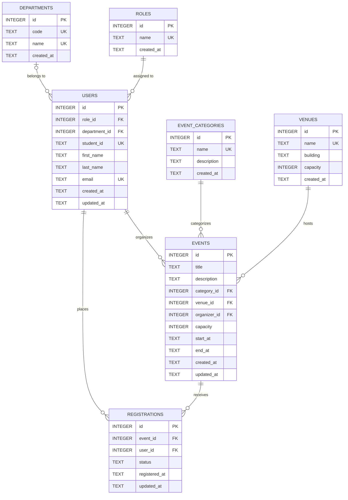

# Midterm Lab Exam: Online Campus Event Management System

## Task 1: Requirements Analysis & Prompt Architecture (30 Mins | 20 Points)
**Lead:** Member 1 (Ramos, Lenard)

---

### 1. Production-Grade Prompt (RCTC Framework)

The following prompt was constructed using the **Role–Context–Task–Constraints (RCTC)** framework to extract a complete, grounded, and rapid-prototyping system architecture from the AI model.

```markdown
[ROLE]
You are a Principal Systems Architect and Full-Stack Technical Lead specializing in rapid prototyping, resilient software architectures, and time-boxed hackathon execution for web applications.

[CONTEXT]
Our university engineering team is tasked with building a fully functional working prototype of an "Online Campus Event Management System" during a strict 3-hour midterm lab examination. The system must fulfill two primary user flows:
1. Students: Browse a real-time catalog of upcoming campus events, view event details (title, description, venue, date/time, and remaining seat capacity), and register for an event via a registration form with immediate visual confirmation.
2. Administrators: Access a dedicated administrative view to inspect registered attendees per event, check current capacity utilization, and filter registrations by event.

[TASK]
Provide a complete, production-grade system architecture and technical design blueprint tailored specifically for our 3-hour sprint. Your response must include:
1. High-Level Architecture Overview: Structural design pattern, client-server data flow, and state handling strategy.
2. Recommended Pragmatic Tech Stack: Front-end framework, back-end runtime, database/persistence layer, and styling library, including justification for zero-friction local setup.
3. Data Models & Entity Schema: Entity definitions for Events, Registrations, and Roles/Users, with field types, primary/foreign keys, and constraints.
4. API & Route Specifications: Endpoints/routes with HTTP methods, request payloads, and status codes.
5. Component Hierarchy & UX Flow: Component tree for the student event catalog, registration modal/form, and admin attendee dashboard.
6. 3-Hour Team Implementation Breakdown: Time-boxed milestone matrix dividing work cleanly across 3 developers (Member 1: Systems Architect, Member 2: Frontend Lead, Member 3: Backend/Integration Lead).

[CONSTRAINTS]
- Negative Constraints:
  * Do NOT use third-party global state management libraries (e.g., Redux, MobX, Zustand, Recoil); rely exclusively on React built-in state (useState, useReducer, useContext) or native framework state.
  * Do NOT implement external OAuth/third-party authentication services (e.g., Auth0, Firebase Auth, Supabase Auth, Keycloak); implement a simple role toggle or lightweight session mock to prevent credential configuration delays.
  * Do NOT use complex multi-service containerization or microservices (e.g., Docker Compose, Kubernetes, RabbitMQ); the entire prototype must run in a single repository via a single development command (e.g., npm run dev).
- Positive Constraints:
  * Must enforce key business logic: prevent duplicate registrations for the same student ID/email on a single event, and prevent registrations once capacity is reached.
  * Must include mock data seeding for at least 3 realistic campus events upon startup.
  * Must be achievable within an 180-minute sprint by 3 student developers.
```

---

### 2. AI Model Output (System Architecture Design)

Below is the complete output generated by the AI model in response to the RCTC prompt:

***

#### System Architecture Blueprint: Online Campus Event Management System Prototype

##### 1. High-Level Architecture Overview
The system follows a **Monolithic Single-Page / Full-Stack Application (Next.js 14 App Router)** architecture with server-side API Route Handlers and client-side interactive views.

```
+-----------------------------------------------------------------------+
|                             Client Layer                              |
|  +---------------------------------+  +----------------------------+  |
|  |       Student Portal View       |  |    Admin Dashboard View    |  |
|  | - Event Catalog & Filters       |  | - Event Selector Dropdown  |  |
|  | - Event Detail Modal            |  | - Attendee Roster Table    |  |
|  | - Registration Form (Validation)|  | - Capacity Progress Bar    |  |
|  +---------------------------------+  +----------------------------+  |
|                                    |                                  |
|         State: React Context + useState (No External Redux)          |
+------------------------------------+----------------------------------+
                                     | JSON over HTTP (fetch)
                                     v
+-----------------------------------------------------------------------+
|                    Application / API Route Layer                      |
|  +-----------------------------------------------------------------+  |
|  | GET  /api/events              - Retrieve all upcoming events    |  |
|  | GET  /api/events/[id]         - Retrieve event with seats left  |  |
|  | POST /api/registrations       - Register with duplicate checks  |  |
|  | GET  /api/admin/attendees     - Retrieve roster by event ID     |  |
|  +-----------------------------------------------------------------+  |
+------------------------------------+----------------------------------+
                                     |
                                     v
+-----------------------------------------------------------------------+
|                       Persistence Layer (Local)                       |
|   SQLite with Prisma ORM / In-Memory JSON Repository with File Sync    |
|   (Zero-config, embedded, auto-seeded on initial server start)        |
+-----------------------------------------------------------------------+
```

- **Architectural Pattern:** Monolithic full-stack application. Co-locating UI and API routes in a single repo eliminates Cross-Origin Resource Sharing (CORS) errors, dual-server synchronization issues, and deployment friction.
- **State Management:** Native React state via `useState` and `useContext` for active event selection and modal controls, combined with standard browser `fetch` and auto-revalidation.
- **Role Switching:** A lightweight navbar toggle (`Student View` vs. `Admin View`) that simulates role permissions without blocking the team on login flows.

---

##### 2. Recommended Pragmatic Tech Stack

| Layer | Technology | Justification for 3-Hour Sprint |
| :--- | :--- | :--- |
| **Framework** | **Next.js 14 (React, TypeScript)** | Single unified codebase for frontend pages and backend API route handlers (`/app/api/*`). Single command startup (`npm run dev`). |
| **Styling** | **Tailwind CSS + Lucide Icons** | Utility-first classes remove the need for custom CSS files; rapid assembly of responsive tables, cards, and modals. |
| **Database & ORM** | **SQLite via Prisma ORM** (or Better-SQLite3) | Serverless, file-based database (`dev.db`). No database installation, Docker daemon, or cloud connection strings required. Auto-generates type-safe database queries. |
| **Form Handling** | **Native HTML5 + Zod** | Lightweight schema validation to guarantee clean payload structure without heavy form abstraction libraries. |

---

##### 3. Data Models & Entity Schema (Prisma/Relational Schema)

```prisma
// schema.prisma

datasource db {
  provider = "sqlite"
  url      = "file:./dev.db"
}

generator client {
  provider = "prisma-client-js"
}

model Event {
  id            String         @id @default(cuid())
  title         String
  description   String
  category      String         // e.g., "Academic", "Workshop", "Sports", "Social"
  venue         String
  date          DateTime
  capacity      Int
  createdAt     DateTime       @default(now())
  registrations Registration[]
}

model Registration {
  id              String   @id @default(cuid())
  eventId         String
  event           Event    @relation(fields: [eventId], references: [id], onDelete: Cascade)
  studentId       String   // University Student ID (e.g., "2021-10492")
  studentName     String
  studentEmail    String
  department      String   // e.g., "College of Computer Studies"
  registeredAt    DateTime @default(now())

  // Constraint: One registration per student ID per event
  @@unique([eventId, studentId])
  // Constraint: One registration per email per event
  @@unique([eventId, studentEmail])
}
```

---

##### 4. Core API Endpoints

| Method | Endpoint | Description | Request Body | Response Codes |
| :--- | :--- | :--- | :--- | :--- |
| `GET` | `/api/events` | List all upcoming events with current registration counts and remaining slots. | _None_ | `200 OK` |
| `GET` | `/api/events/:id` | Get single event details with registered count. | _None_ | `200 OK`, `404 Not Found` |
| `POST` | `/api/registrations` | Register a student for a specific event. | `{ eventId, studentId, studentName, studentEmail, department }` | `201 Created`, `400 Bad Request` (Validation), `409 Conflict` (Duplicate/Full) |
| `GET` | `/api/admin/attendees` | Get attendees filtered by `eventId` query parameter (`/api/admin/attendees?eventId=xyz`). | _None_ | `200 OK`, `400 Bad Request` |

**Validation & Conflict Handling Rules:**
1. **Duplicate Check:** If `Registration` with `(eventId, studentId)` or `(eventId, studentEmail)` already exists, return `409 Conflict` with `{ error: "You are already registered for this event." }`.
2. **Capacity Check:** Compute `totalRegistrations = count(Registration where eventId = x)`. If `totalRegistrations >= Event.capacity`, return `409 Conflict` with `{ error: "Event capacity has been reached." }`.

---

##### 5. Component Hierarchy & UX Wireflow

```
AppLayout (Navbar with Role Toggle: Student | Admin, Campus Logo)
 ├── Student Portal (Active when Role == "Student")
 │    ├── EventFilterBar (Search input, Department/Category chips)
 │    ├── EventGrid
 │    │    └── EventCard (Title, Date, Venue, Capacity Badge [X/Y seats], "Register" Button)
 │    └── RegistrationModal (Form with Student ID, Name, Email, Dept, Submit Button, Feedback Alert)
 └── Admin Dashboard (Active when Role == "Admin")
      ├── AdminSummaryCards (Total Events, Total Registrations, Average Attendance)
      ├── EventSelectorDropdown (Pick an event to view roster)
      ├── CapacityMetricsBar (Progress bar showing % of seats filled)
      └── AttendeeRosterTable (Columns: Student ID, Name, Email, Dept, Registered Date/Time, Export/Print button)
```

---

##### 6. 3-Hour Team Implementation Breakdown

| Timeline | Member 1 (Systems Architect) | Member 2 (Frontend Lead) | Member 3 (Backend & Integration Lead) |
| :--- | :--- | :--- | :--- |
| **00:00 – 00:30** *(30m)* | Initialize Next.js project, Tailwind CSS, Prisma SQLite setup, define schemas, and write database seed script with 3 sample events. | Scaffold UI layout, navigation bar with mock role toggle, and design base responsive container. | Setup API Route skeleton (`/api/events`, `/api/registrations`), and configure database connection utility. |
| **00:30 – 01:30** *(60m)* | Implement database queries, capacity validation helper, and duplicate registration protection logic. | Build `EventCard`, `EventGrid`, filter components, and mock modal for student registration. | Implement `/api/registrations` POST handler with input validation and `/api/admin/attendees` GET handler. |
| **01:30 – 02:30** *(60m)* | Build Admin Dashboard view (`AttendeeRosterTable`, `CapacityMetricsBar`) and hook up to attendee API. | Connect `RegistrationModal` to POST API with loading states, error toast/alerts, and success confirmation. | Conduct end-to-end integration tests (student registration -> database update -> admin view instant reflection). |
| **02:30 – 03:00** *(30m)* | Perform manual regression testing, capacity limit testing, edge-case testing, and finalize `SUBMISSION.md`. | Polish CSS, responsive layouts, badges, and empty-state placeholders. | Verify zero console errors, clean up unused code, and rehearse presentation demo flow. |

***

---

### 3. Manual Grounding Evaluation

The AI-generated architecture is realistic and achievable for a 3-hour team prototype because it selects a unified full-stack framework (Next.js with Tailwind CSS and SQLite/Prisma) that eliminates multi-repository setup, port conflicts, and external database installation delays. By strictly enforcing the negative constraints—disallowing third-party state managers like Redux and external authentication services—it prevents the team from falling into boilerplate traps and keeps state handling within lightweight native React hooks. The modular 3-way work breakdown cleanly decouples data models, student-facing UI, and admin API endpoints, ensuring all three team members can develop concurrently without blocking one another. Furthermore, utilizing a file-based SQLite database with pre-seeded mock campus events ensures the system can be demonstrated with realistic data immediately upon launch.


---

## Task 2: 3NF Relational Database Architecture & DDL Implementation (30 Mins | 25 Points)
**Lead:** Member 2 / Systems Architect

### 1. 3NF Schema Design & Normalization Justification
*Refer to full documentation in [`SCHEMA_DESIGN.md`](file:///C:/Users/Alen/Documents/dev/work/S-ITPE006LA-MIDTERM-LAB-EXAM/SCHEMA_DESIGN.md) and Prisma schema in [`prisma/schema.prisma`](file:///C:/Users/Alen/Documents/dev/work/S-ITPE006LA-MIDTERM-LAB-EXAM/prisma/schema.prisma).*

#### Entities & Keys
- **`roles`**: `id` (PK), `name` (UK)
- **`departments`**: `id` (PK), `code` (UK), `name` (UK)
- **`users`**: `id` (PK), `role_id` (FK), `department_id` (FK), `student_id` (UK), `email` (UK)
- **`event_categories`**: `id` (PK), `name` (UK)
- **`venues`**: `id` (PK), `name` (UK), `capacity` (CHECK > 0)
- **`events`**: `id` (PK), `category_id` (FK), `venue_id` (FK), `organizer_id` (FK), `capacity` (CHECK > 0), `start_at`, `end_at` (CHECK `end_at > start_at`)
- **`registrations`**: `id` (PK), `event_id` (FK), `user_id` (FK), `status` (CHECK), `UNIQUE(user_id, event_id)`

#### Transitive Dependency Elimination
- Redundant student profiles (name, email, department) live strictly in `users`, not duplicated in `registrations`.
- Venue properties (building, venue capacity) and category metadata live in `venues` and `event_categories`, not duplicated in `events`.
- Academic affiliations live in `departments`, referenced by `users.department_id`.

---

### 2. Entity-Relationship Diagram (Mermaid.js)



---

### 3. Production SQL DDL & Seed Script
The executable SQL script is located at [`schema.sql`](file:///C:/Users/Alen/Documents/dev/work/S-ITPE006LA-MIDTERM-LAB-EXAM/schema.sql).
