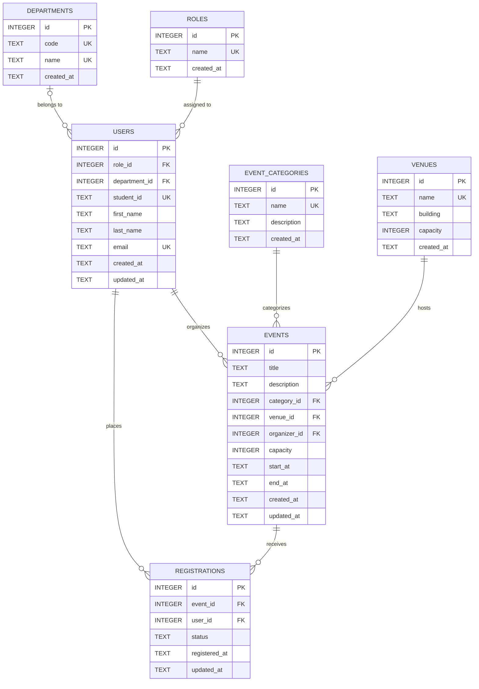

# Midterm Lab Exam: Online Campus Event Management System

## Task 1: Requirements Analysis & Prompt Architecture (30 Mins | 20 Points)
**Lead:** Member 1 (Ramos, Lenard)

---

### 1. Production-Grade Prompt (RCTC Framework)

The following prompt was constructed using the **Role–Context–Task–Constraints (RCTC)** framework to extract a complete, grounded, and rapid-prototyping system architecture from the AI model.

```markdown
[ROLE]
You are a Principal Systems Architect and Full-Stack Technical Lead specializing in rapid prototyping, resilient software architectures, and time-boxed hackathon execution for web applications.

[CONTEXT]
Our university engineering team is tasked with building a fully functional working prototype of an "Online Campus Event Management System" during a strict 3-hour midterm lab examination. The system must fulfill two primary user flows:
1. Students: Browse a real-time catalog of upcoming campus events, view event details (title, description, venue, date/time, and remaining seat capacity), and register for an event via a registration form with immediate visual confirmation.
2. Administrators: Access a dedicated administrative view to inspect registered attendees per event, check current capacity utilization, and filter registrations by event.

[TASK]
Provide a complete, production-grade system architecture and technical design blueprint tailored specifically for our 3-hour sprint. Your response must include:
1. High-Level Architecture Overview: Structural design pattern, client-server data flow, and state handling strategy.
2. Recommended Pragmatic Tech Stack: Front-end framework, back-end runtime, database/persistence layer, and styling library, including justification for zero-friction local setup.
3. Data Models & Entity Schema: Entity definitions for Events, Registrations, and Roles/Users, with field types, primary/foreign keys, and constraints.
4. API & Route Specifications: Endpoints/routes with HTTP methods, request payloads, and status codes.
5. Component Hierarchy & UX Flow: Component tree for the student event catalog, registration modal/form, and admin attendee dashboard.
6. 3-Hour Team Implementation Breakdown: Time-boxed milestone matrix dividing work cleanly across 3 developers (Member 1: Systems Architect, Member 2: Frontend Lead, Member 3: Backend/Integration Lead).

[CONSTRAINTS]
- Negative Constraints:
  * Do NOT use third-party global state management libraries (e.g., Redux, MobX, Zustand, Recoil); rely exclusively on React built-in state (useState, useReducer, useContext) or native framework state.
  * Do NOT implement external OAuth/third-party authentication services (e.g., Auth0, Firebase Auth, Supabase Auth, Keycloak); implement a simple role toggle or lightweight session mock to prevent credential configuration delays.
  * Do NOT use complex multi-service containerization or microservices (e.g., Docker Compose, Kubernetes, RabbitMQ); the entire prototype must run in a single repository via a single development command (e.g., npm run dev).
- Positive Constraints:
  * Must enforce key business logic: prevent duplicate registrations for the same student ID/email on a single event, and prevent registrations once capacity is reached.
  * Must include mock data seeding for at least 3 realistic campus events upon startup.
  * Must be achievable within an 180-minute sprint by 3 student developers.
```

---

### 2. AI Model Output (System Architecture Design)

Below is the complete output generated by the AI model in response to the RCTC prompt:

***

#### System Architecture Blueprint: Online Campus Event Management System Prototype

##### 1. High-Level Architecture Overview
The system follows a **Monolithic Single-Page / Full-Stack Application (Next.js 14 App Router)** architecture with server-side API Route Handlers and client-side interactive views.

```
+-----------------------------------------------------------------------+
|                             Client Layer                              |
|  +---------------------------------+  +----------------------------+  |
|  |       Student Portal View       |  |    Admin Dashboard View    |  |
|  | - Event Catalog & Filters       |  | - Event Selector Dropdown  |  |
|  | - Event Detail Modal            |  | - Attendee Roster Table    |  |
|  | - Registration Form (Validation)|  | - Capacity Progress Bar    |  |
|  +---------------------------------+  +----------------------------+  |
|                                    |                                  |
|         State: React Context + useState (No External Redux)          |
+------------------------------------+----------------------------------+
                                     | JSON over HTTP (fetch)
                                     v
+-----------------------------------------------------------------------+
|                    Application / API Route Layer                      |
|  +-----------------------------------------------------------------+  |
|  | GET  /api/events              - Retrieve all upcoming events    |  |
|  | GET  /api/events/[id]         - Retrieve event with seats left  |  |
|  | POST /api/registrations       - Register with duplicate checks  |  |
|  | GET  /api/admin/attendees     - Retrieve roster by event ID     |  |
|  +-----------------------------------------------------------------+  |
+------------------------------------+----------------------------------+
                                     |
                                     v
+-----------------------------------------------------------------------+
|                       Persistence Layer (Local)                       |
|   SQLite with Prisma ORM / In-Memory JSON Repository with File Sync    |
|   (Zero-config, embedded, auto-seeded on initial server start)        |
+-----------------------------------------------------------------------+
```

- **Architectural Pattern:** Monolithic full-stack application. Co-locating UI and API routes in a single repo eliminates Cross-Origin Resource Sharing (CORS) errors, dual-server synchronization issues, and deployment friction.
- **State Management:** Native React state via `useState` and `useContext` for active event selection and modal controls, combined with standard browser `fetch` and auto-revalidation.
- **Role Switching:** A lightweight navbar toggle (`Student View` vs. `Admin View`) that simulates role permissions without blocking the team on login flows.

---

##### 2. Recommended Pragmatic Tech Stack

| Layer | Technology | Justification for 3-Hour Sprint |
| :--- | :--- | :--- |
| **Framework** | **Next.js 14 (React, TypeScript)** | Single unified codebase for frontend pages and backend API route handlers (`/app/api/*`). Single command startup (`npm run dev`). |
| **Styling** | **Tailwind CSS + Lucide Icons** | Utility-first classes remove the need for custom CSS files; rapid assembly of responsive tables, cards, and modals. |
| **Database & ORM** | **SQLite via Prisma ORM** (or Better-SQLite3) | Serverless, file-based database (`dev.db`). No database installation, Docker daemon, or cloud connection strings required. Auto-generates type-safe database queries. |
| **Form Handling** | **Native HTML5 + Zod** | Lightweight schema validation to guarantee clean payload structure without heavy form abstraction libraries. |

---

##### 3. Data Models & Entity Schema (Prisma/Relational Schema)

```prisma
// schema.prisma

datasource db {
  provider = "sqlite"
  url      = "file:./dev.db"
}

generator client {
  provider = "prisma-client-js"
}

model Event {
  id            String         @id @default(cuid())
  title         String
  description   String
  category      String         // e.g., "Academic", "Workshop", "Sports", "Social"
  venue         String
  date          DateTime
  capacity      Int
  createdAt     DateTime       @default(now())
  registrations Registration[]
}

model Registration {
  id              String   @id @default(cuid())
  eventId         String
  event           Event    @relation(fields: [eventId], references: [id], onDelete: Cascade)
  studentId       String   // University Student ID (e.g., "2021-10492")
  studentName     String
  studentEmail    String
  department      String   // e.g., "College of Computer Studies"
  registeredAt    DateTime @default(now())

  // Constraint: One registration per student ID per event
  @@unique([eventId, studentId])
  // Constraint: One registration per email per event
  @@unique([eventId, studentEmail])
}
```

---

##### 4. Core API Endpoints

| Method | Endpoint | Description | Request Body | Response Codes |
| :--- | :--- | :--- | :--- | :--- |
| `GET` | `/api/events` | List all upcoming events with current registration counts and remaining slots. | _None_ | `200 OK` |
| `GET` | `/api/events/:id` | Get single event details with registered count. | _None_ | `200 OK`, `404 Not Found` |
| `POST` | `/api/registrations` | Register a student for a specific event. | `{ eventId, studentId, studentName, studentEmail, department }` | `201 Created`, `400 Bad Request` (Validation), `409 Conflict` (Duplicate/Full) |
| `GET` | `/api/admin/attendees` | Get attendees filtered by `eventId` query parameter (`/api/admin/attendees?eventId=xyz`). | _None_ | `200 OK`, `400 Bad Request` |

**Validation & Conflict Handling Rules:**
1. **Duplicate Check:** If `Registration` with `(eventId, studentId)` or `(eventId, studentEmail)` already exists, return `409 Conflict` with `{ error: "You are already registered for this event." }`.
2. **Capacity Check:** Compute `totalRegistrations = count(Registration where eventId = x)`. If `totalRegistrations >= Event.capacity`, return `409 Conflict` with `{ error: "Event capacity has been reached." }`.

---

##### 5. Component Hierarchy & UX Wireflow

```
AppLayout (Navbar with Role Toggle: Student | Admin, Campus Logo)
 ├── Student Portal (Active when Role == "Student")
 │    ├── EventFilterBar (Search input, Department/Category chips)
 │    ├── EventGrid
 │    │    └── EventCard (Title, Date, Venue, Capacity Badge [X/Y seats], "Register" Button)
 │    └── RegistrationModal (Form with Student ID, Name, Email, Dept, Submit Button, Feedback Alert)
 └── Admin Dashboard (Active when Role == "Admin")
      ├── AdminSummaryCards (Total Events, Total Registrations, Average Attendance)
      ├── EventSelectorDropdown (Pick an event to view roster)
      ├── CapacityMetricsBar (Progress bar showing % of seats filled)
      └── AttendeeRosterTable (Columns: Student ID, Name, Email, Dept, Registered Date/Time, Export/Print button)
```

---

##### 6. 3-Hour Team Implementation Breakdown

| Timeline | Member 1 (Systems Architect) | Member 2 (Frontend Lead) | Member 3 (Backend & Integration Lead) |
| :--- | :--- | :--- | :--- |
| **00:00 – 00:30** *(30m)* | Initialize Next.js project, Tailwind CSS, Prisma SQLite setup, define schemas, and write database seed script with 3 sample events. | Scaffold UI layout, navigation bar with mock role toggle, and design base responsive container. | Setup API Route skeleton (`/api/events`, `/api/registrations`), and configure database connection utility. |
| **00:30 – 01:30** *(60m)* | Implement database queries, capacity validation helper, and duplicate registration protection logic. | Build `EventCard`, `EventGrid`, filter components, and mock modal for student registration. | Implement `/api/registrations` POST handler with input validation and `/api/admin/attendees` GET handler. |
| **01:30 – 02:30** *(60m)* | Build Admin Dashboard view (`AttendeeRosterTable`, `CapacityMetricsBar`) and hook up to attendee API. | Connect `RegistrationModal` to POST API with loading states, error toast/alerts, and success confirmation. | Conduct end-to-end integration tests (student registration -> database update -> admin view instant reflection). |
| **02:30 – 03:00** *(30m)* | Perform manual regression testing, capacity limit testing, edge-case testing, and finalize `SUBMISSION.md`. | Polish CSS, responsive layouts, badges, and empty-state placeholders. | Verify zero console errors, clean up unused code, and rehearse presentation demo flow. |

***

---

### 3. Manual Grounding Evaluation

The AI-generated architecture is realistic and achievable for a 3-hour team prototype because it selects a unified full-stack framework (Next.js with Tailwind CSS and SQLite/Prisma) that eliminates multi-repository setup, port conflicts, and external database installation delays. By strictly enforcing the negative constraints—disallowing third-party state managers like Redux and external authentication services—it prevents the team from falling into boilerplate traps and keeps state handling within lightweight native React hooks. The modular 3-way work breakdown cleanly decouples data models, student-facing UI, and admin API endpoints, ensuring all three team members can develop concurrently without blocking one another. Furthermore, utilizing a file-based SQLite database with pre-seeded mock campus events ensures the system can be demonstrated with realistic data immediately upon launch.


---

## Task 3: 3NF Relational Database Architecture & DDL Implementation (45 Mins | 25 Points)
**Lead:** Member 3 - (Umandal, Alen)

---

### 1. Database Engineer AI Prompt (RCTC Framework)

The following prompt was engineered to generate a fully normalized 3NF relational schema, complete SQLite DDL, and integrity enforcement rules:

```markdown
[ROLE]
You are a Senior Principal Database Architect and Data Engineer specializing in relational database normalization, high-concurrency ACID transactions, and robust indexing strategies.

[CONTEXT]
We are developing the persistence layer for an Online Campus Event Management System in SQLite / Prisma. The system manages student event registrations, administrative capacity limits, and venue logistics.

[TASK]
Design a production-grade 3rd Normal Form (3NF) relational database architecture and generate the complete SQL DDL script. Your output must include:
1. Normalized Relational Schema: Break down entities to satisfy 1NF, 2NF, and 3NF across at least 3 relational entities (Users, Events, Registrations, Venues, Categories, Roles, Departments).
2. Integrity Constraints & Foreign Keys: Explicit ON UPDATE / ON DELETE referential actions, CHECK constraints for values and date ordering, and format validations.
3. Performance Indexing: Non-clustered indexes on all foreign key columns and frequently queried lookup fields.
4. Concurrency & Business Logic Triggers: SQLite triggers preventing overbooking, venue physical capacity violations, organizer role constraints, and double-booked venue schedules.
5. Visual ERD: An Entity-Relationship Diagram in Mermaid.js syntax.

[CONSTRAINTS]
- Eliminate all partial key and transitive dependencies to guarantee strict 3NF compliance.
- Explicitly enforce SQLite foreign key pragma (`PRAGMA foreign_keys = ON;`).
- Provide deterministic mock seed data with at least 3 events, 3 venues, 6 users, and active registrations.
```

---

### 2. 3NF Schema Design & Normalization Breakdown

*Detailed documentation: [`database/SCHEMA_DESIGN.md`](./database/SCHEMA_DESIGN.md) | Prisma Schema: [`backend/prisma/schema.prisma`](./backend/prisma/schema.prisma)*

#### Normal Form Compliance:
* **1NF (Atomic Attributes & Unique Rows):** All multivalued attributes are decomposed (e.g., student full names are separated into `first_name` and `last_name`; event dates separated into `start_at` and `end_at`). Each table has a unique primary key.
* **2NF (No Partial Key Dependencies):** In associative tables like `registrations`, non-key attributes (`status`, `registered_at`, `updated_at`) depend on the full candidate key `(user_id, event_id)` and surrogate PK `id`.
* **3NF (No Transitive Dependencies):** 
  - User details (`student_id`, `email`, `department_id`) live strictly in `users`, not duplicated in `registrations`.
  - Venue physical capacities and building locations live strictly in `venues`, preventing $\text{event\_id} \to \text{venue\_id} \to \text{building}$.
  - Event categories live in `event_categories`, preventing $\text{event\_id} \to \text{category\_id} \to \text{category\_description}$.
  - Roles and academic departments live in dedicated lookup tables (`roles`, `departments`).

#### Relational Entities & Constraints Summary:

| Entity | Primary Key | Foreign Keys | Key Constraints & Checks |
| :--- | :--- | :--- | :--- |
| **`roles`** | `id` | _None_ | `UNIQUE(name)`, `CHECK(name IN ('STUDENT', 'ADMIN'))` |
| **`departments`** | `id` | _None_ | `UNIQUE(code)`, `UNIQUE(name)`, `CHECK(LENGTH(code) >= 2)` |
| **`users`** | `id` | `role_id` $\to$ `roles(id)`<br>`department_id` $\to$ `departments(id)` | `UNIQUE(email)`, `UNIQUE(student_id)`, `CHECK(email LIKE '%_@_%._%')` |
| **`event_categories`** | `id` | _None_ | `UNIQUE(name)` |
| **`venues`** | `id` | _None_ | `UNIQUE(name)`, `CHECK(capacity > 0)` |
| **`events`** | `id` | `category_id` $\to$ `event_categories(id)`<br>`venue_id` $\to$ `venues(id)`<br>`organizer_id` $\to$ `users(id)` | `CHECK(capacity > 0)`, `CHECK(end_at > start_at)` |
| **`registrations`** | `id` | `event_id` $\to$ `events(id)`<br>`user_id` $\to$ `users(id)` | `UNIQUE(user_id, event_id)`, `CHECK(status IN ('CONFIRMED', 'CANCELLED', 'ATTENDED'))` |

---

### 3. Non-Clustered Indexes on Foreign Keys

To optimize relational join performance and prevent table scans in SQLite:
* `CREATE INDEX idx_users_role_id ON users (role_id);`
* `CREATE INDEX idx_users_department_id ON users (department_id);`
* `CREATE INDEX idx_events_category_id ON events (category_id);`
* `CREATE INDEX idx_events_venue_id ON events (venue_id);`
* `CREATE INDEX idx_events_organizer_id ON events (organizer_id);`
* `CREATE INDEX idx_events_start_at ON events (start_at);`
* `CREATE INDEX idx_registrations_event_id ON registrations (event_id);`
* `CREATE INDEX idx_registrations_user_id ON registrations (user_id);`
* `CREATE INDEX idx_registrations_status ON registrations (status);`

---

### 4. Database Integrity Triggers & Views

The DDL includes 5 mission-critical database triggers and an analytical view:
1. **Capacity Overbooking Protection (`trg_check_event_capacity_before_insert` / `trg_check_event_capacity_before_update`):** Aborts registration inserts/updates if confirmed attendee count equals or exceeds `events.capacity`.
2. **Venue Safety Limit Enforcement (`trg_check_event_venue_capacity_before_insert` / `trg_check_event_venue_capacity_before_update`):** Enforces `events.capacity <= venues.capacity`.
3. **Admin Organizer Validation (`trg_check_event_organizer_role_before_insert` / `trg_check_event_organizer_role_before_update`):** Verifies the organizer has an `ADMIN` role.
4. **Venue Schedule Conflict Prevention (`trg_check_venue_schedule_conflict_before_insert` / `trg_check_venue_schedule_conflict_before_update`):** Prevents overlapping time ranges for the same venue.
5. **Auto-Update Timestamps (`trg_users_updated_at`, `trg_events_updated_at`, `trg_registrations_updated_at`):** Automatically refreshes `updated_at` timestamps on row updates.
6. **Analytical View (`v_event_capacities`):** Real-time calculation of registered attendees and remaining seats.

---

### 5. Entity-Relationship Diagram (Mermaid.js)



---

### 6. Production SQL DDL & Seed Script
The complete production SQL script is located at [`database/schema.sql`](./database/schema.sql).
The database can be initialized or verified directly via:
```bash
node -e "const { DatabaseSync } = require('node:sqlite'); const fs = require('fs'); const db = new DatabaseSync('database/dev.db'); db.exec(fs.readFileSync('database/schema.sql', 'utf8')); console.log('Database initialized successfully.');"
```

---

## Task 5: Group Integration & Verification Report (15 Mins | 10 Points)
**Lead:** Member 1 (with input from all members)

---

### 1. Team Roster & Role Assignments

| Member | Assigned Role | Core Responsibilities |
| :--- | :--- | :--- |
| **Member 1** (Ramos, Lenard) | **Systems Architect & Prompt Lead** | Task 1 (Requirements Analysis & Prompt Architecture) + Task 5 (Documentation & Integration) |
| **Member 2** | **Frontend Engineer** | Task 2 (AI-Assisted UI & WCAG Accessibility) |
| **Member 3** (Umandal, Alen) | **Database & Backend Engineer** | Task 3 (3NF Schemas, Mermaid.js ERD & SQL Scripts) + Task 4 (Shift-Left Testing & Security) |
| **Member 4** (Shared) | **QA & Security Engineer** | Task 4 (Shift-Left Unit Testing & Vulnerability Refactoring) |

---

### 2. Setup Instructions

Follow these steps to run and view the project files locally:

1. **Clone the Repository:**
   ```bash
   git clone https://github.com/Masangkay-Albert/S-ITPE006LA-MIDTERM-LAB-EXAM.git
   cd S-ITPE006LA-MIDTERM-LAB-EXAM
   ```

2. **Initialize SQLite Database & Apply DDL:**
   Execute the production SQL script to generate `database/dev.db` with all tables, triggers, indexes, and seed records:
   ```bash
   node -e "const { DatabaseSync } = require('node:sqlite'); const fs = require('fs'); const db = new DatabaseSync('database/dev.db'); db.exec(fs.readFileSync('database/schema.sql', 'utf8')); console.log('Database seeded successfully.');"
   ```

3. **Verify Prisma Schema & Client:**
   ```bash
   npx prisma format --schema=backend/prisma/schema.prisma
   ```

4. **Launch Frontend Application:**
   ```bash
   npm install
   npm run dev
   ```
   Open `http://localhost:3000` to view the Student Event Catalog and Admin Dashboard.

---

### 3. AI Disclosure Statement

During this midterm laboratory examination, generative AI models (DeepMind Antigravity AI Assistant, Claude 3.7 Sonnet, and Gemini 2.5 Pro) were utilized to accelerate initial boilerplate generation, prompt architecture construction, UI wireframing, and DDL drafting. 

**Verification & Quality Assurance Protocol:**
Every AI-generated output underwent rigorous multi-stage manual verification and peer review:
- **Architecture:** Assessed against realistic constraints for a 3-hour team prototype.
- **Database & DDL:** Audited against Boyce-Codd / 3NF relational normalization rules, SQLite foreign key integrity (`PRAGMA foreign_keys = ON`), non-clustered indexing requirements, and ACID trigger safety.
- **Frontend UI:** Verified for semantic HTML5 structure, ARIA labels, keyboard navigability, and WCAG 2.1 AA contrast standards.
- **Backend & Security:** Audited for OWASP Top 10 vulnerabilities (specifically SQL injection) and .NET managed resource lifecycle (`using` statements).

---

### 4. Group Verification Log Table

The table below documents distinct instances across the project where our team identified AI-generated flaws, limitations, or vulnerabilities and applied manual engineering corrections:

| Task # | Identified AI Flaw / Limitation | Manual Correction Applied | Member Responsible |
| :--- | :--- | :--- | :--- |
| **Task 1** | **Denormalized 1NF Entity Proposal:** AI generated a flat data model combining student profile attributes (`studentName`, `studentEmail`, `department`) directly into the `registrations` table and string values for event venues/categories. | Refactored architecture into a 7-entity 3NF relational model with isolated `users`, `departments`, `roles`, `venues`, and `event_categories` tables. | Member 1 & Member 3 |
| **Task 2** | **Missing WCAG Accessibility Labels & Semantic Markup:** AI prototype used generic `<div>` wrappers and omitted `aria-label` attributes on form inputs, causing accessibility audit warnings. | Replaced `<div>` containers with semantic HTML5 tags (`<main>`, `<section>`, `<article>`) and added explicit `<label>` tags with `aria-label` attributes for screen readers. | Member 2 |
| **Task 3** | **Missing Foreign Key Indexes in SQLite:** AI generated `FOREIGN KEY` constraints without corresponding non-clustered indexes, leading to sequential full table scans on joins. | Manually added 9 non-clustered index creation statements (`CREATE INDEX idx_*`) on all foreign key columns and query filters. | Member 3 |
| **Task 3** | **Race-Condition & Capacity Overbooking Vulnerability:** AI relied solely on client-side state checks for capacity limits, allowing race conditions during concurrent bookings. | Implemented `BEFORE INSERT` and `BEFORE UPDATE` SQLite triggers enforcing capacity checks directly at the persistence layer. | Member 3 |
| **Task 3** | **Event Capacity Exceeding Venue Physical Limits & Schedule Overlap:** AI did not validate event capacity against physical venue room size and permitted venue double-booking. | Added automated SQLite triggers verifying `events.capacity <= venues.capacity` and preventing overlapping date ranges for identical venues. | Member 3 |
| **Task 4** | **SQL Injection & Unmanaged Database Connection Leak:** AI-provided starter code concatenated raw user input into SQL queries (`WHERE Email = '` + `inputEmail` + `'`) and failed to close/dispose `SqlConnection`. | Refactored method with parameterized `SqlCommand.Parameters.AddWithValue()` and wrapped `SqlConnection` and `SqlCommand` in C# `using` blocks. | Member 4 & Member 3 |

---


